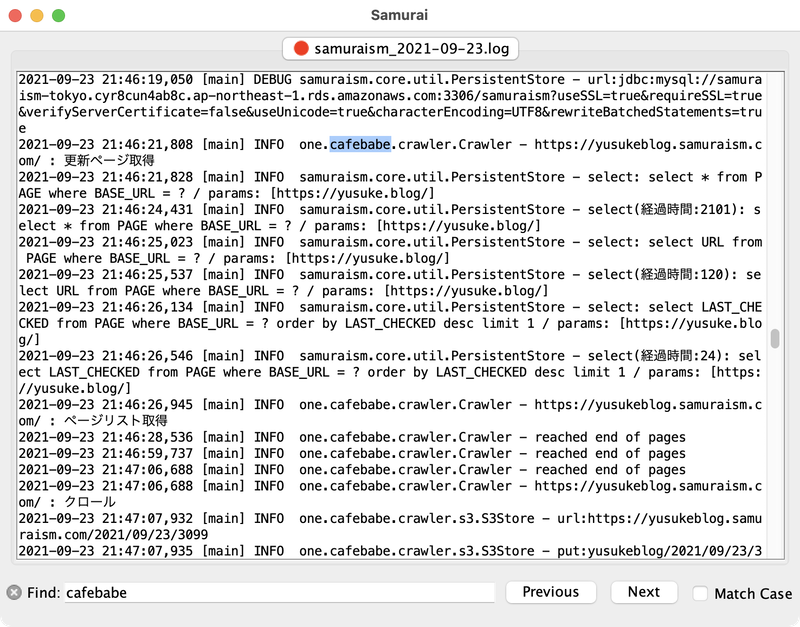
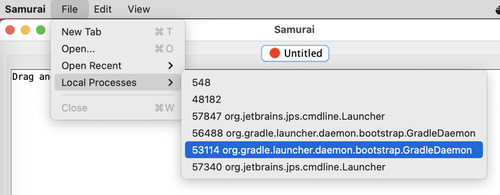
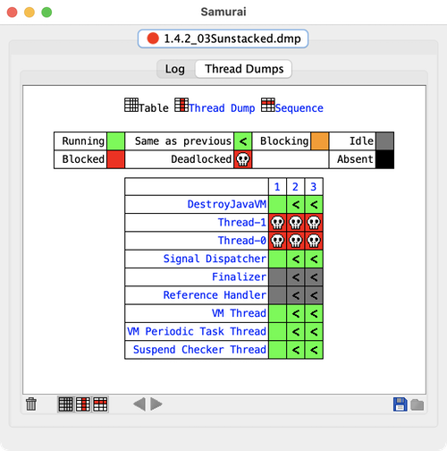
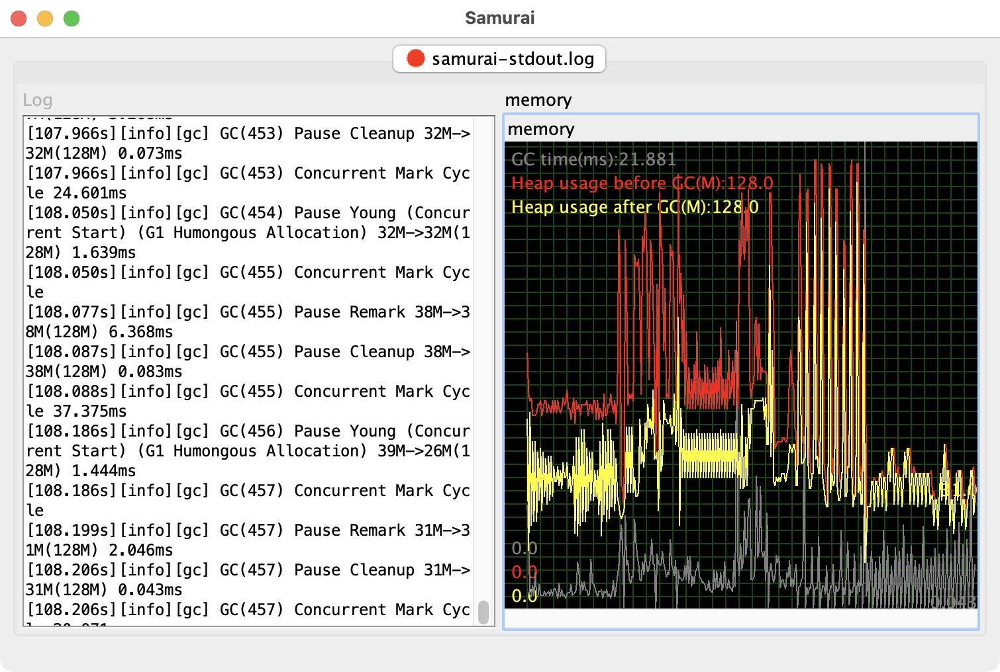

# Samurai
Samurai is an analysis tool for Java thread dumps / GC logs.

[&#35;samuraiApp](https://twitter.com/search?q=%23samuraiApp&src=typed_query&f=live)

## What does it offer?
- Tail log files

Just drag and drop files you want to tail.

- Take thread dumps of local processes

From File > Local Processes

- Visualize thread dumps

- Visualize GC logs

